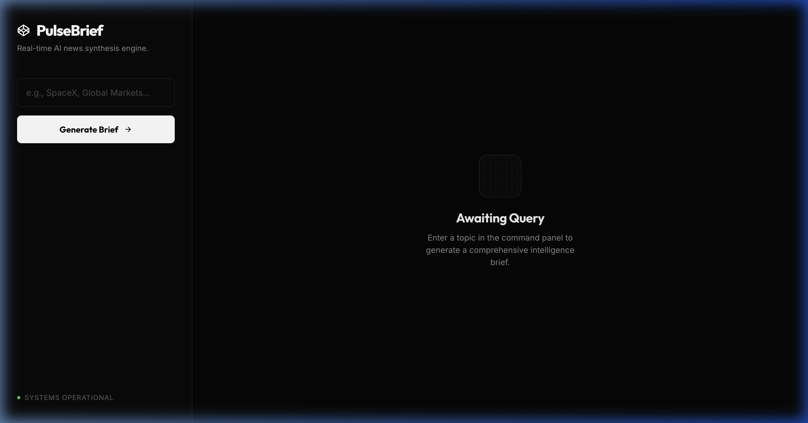
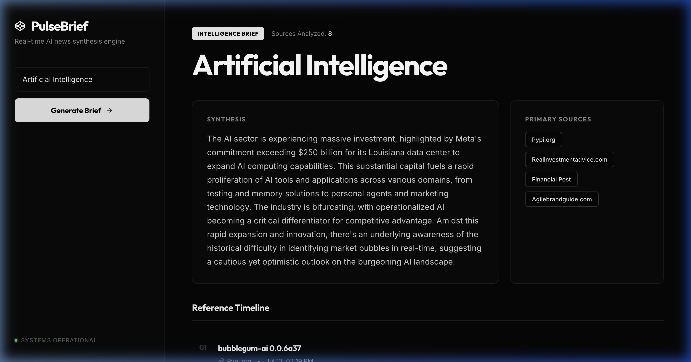

<div align="center">

# PulseBrief

**Real-time AI news synthesis engine powered by Google Gemini and NewsAPI**

[](https://openjdk.java.net/)
[](https://spring.io/projects/spring-boot)
[](https://ai.google.dev/)
[](https://www.docker.com/)
[](LICENSE)

[Live Demo](https://pulse-brief.vercel.app) · [API Reference](#api-reference) · [Architecture](#architecture) · [Quick Start](#quick-start)

</div>

---

## Overview

PulseBrief is a production-ready news aggregation and AI summarization service. Enter any topic — the backend fetches the latest articles from NewsAPI, feeds them through **Google Gemini 2.5 Flash** for intelligent synthesis, and returns a structured intelligence brief with source attribution and a reference timeline.

<div align="center">

<br/>
<sub><b>Fig 1.</b> Command panel — enter any topic to generate an intelligence brief.</sub>
<br/><br/>

<br/>
<sub><b>Fig 2.</b> Generated brief for "Artificial Intelligence" — synthesis, source chips, and reference timeline.</sub>
</div>

---

## Tech Stack

| Layer | Technology | Purpose |
|-------|-----------|---------|
| **Runtime** | Java 17, Spring Boot 3.3.4 | Application framework & dependency injection |
| **AI** | Google Gemini 2.5 Flash | News content summarization via `generateContent` API |
| **Data** | NewsAPI.org `/v2/everything` | Real-time article aggregation (8 articles/request) |
| **Caching** | Caffeine (in-process) | 10-min TTL, 100-entry LRU, keyed by normalized topic |
| **Security** | Per-IP rate limiter | Sliding-window, 20 req/min on `/api/**` endpoints |
| **Frontend** | Vanilla HTML/CSS/JS | Zero-dependency dark-themed UI with bento-grid layout |
| **Deployment** | Docker (multi-stage) | `eclipse-temurin:17-jre-alpine` runtime (~180MB image) |

---

## Architecture


### Request Flow

```
Client (Browser)
  │
  ├─ GET /api/v1/news/summary?topic=...
  │
  ▼
┌──────────────────────────────────────────────┐
│  Spring Boot                                 │
│                                              │
│  RateLimitFilter (20 req/min per IP)         │
│       │                                      │
│       ▼                                      │
│  NewsSummaryController                       │
│       │  @Validated (2–80 chars)             │
│       ▼                                      │
│  NewsSummaryService (@Cacheable)             │
│       │                                      │
│       ├──► NewsApiClient ──► newsapi.org     │
│       │    (fetch 8 articles, extract        │
│       │     title/description/content)       │
│       │                                      │
│       └──► GeminiClient ──► Gemini API       │
│            (prompt: ~6KB context cap,        │
│             temp=0.2, maxTokens=1024,        │
│             exponential backoff: 2s/4s/8s)   │
│                                              │
│  ◄── NewsSummaryResponse (JSON) ────────────►│
└──────────────────────────────────────────────┘
```

### Key Design Decisions

- **Prompt context capping** — Article content is truncated to 6,000 chars to stay within model token budget and reduce latency.
- **Retry with exponential backoff** — `GeminiClient` retries on `429`/`503` up to 3 times with `2s → 4s → 8s` delays.
- **Cache-first architecture** — Identical topic queries within 10 minutes hit Caffeine cache, zero external API calls.
- **Auto-backend detection** — Frontend auto-detects `localhost` vs. production URL (`Render`) for seamless dev/prod parity.

---

## Quick Start

### Prerequisites

- **Java 17+** (JDK, not JRE — Maven wrapper handles the build)
- API keys from [NewsAPI](https://newsapi.org/) and [Google AI Studio](https://aistudio.google.com/apikey)

### 1. Clone & Configure

```bash
git clone https://github.com/Nickloveschihuahuas/PulseBrief.git
cd PulseBrief
```

Create a `.env` file from the provided example:

```bash
cp .env.example .env
```

Edit `.env` and add your keys:

```properties
NEWS_API_KEY=your_newsapi_key_here
GEMINI_API_KEY=your_gemini_api_key_here
```

### 2. Run the Backend

```bash
./mvnw spring-boot:run
```

Backend starts on `http://localhost:8080`.

### 3. Open the Frontend

```bash
open frontend/index.html
```

The frontend auto-detects `localhost` and connects to port `8080`.

### Docker

```bash
# Build
docker build -t pulsebrief .

# Run
docker run -p 8080:8080 \
  -e NEWS_API_KEY=your_key \
  -e GEMINI_API_KEY=your_key \
  pulsebrief
```

> The Dockerfile uses a multi-stage build: `eclipse-temurin:17-jdk-alpine` for compilation, `eclipse-temurin:17-jre-alpine` for runtime. The frontend is bundled into `/app/static/` and served by Spring Boot.

---

## API Reference

### `GET /api/v1/news/summary`

Fetch an AI-generated intelligence brief for a given topic.

#### Request

| Parameter | Type | Required | Constraints | Description |
|-----------|------|----------|-------------|-------------|
| `topic` | `string` | Yes | 2–80 chars, non-blank | News topic to summarize |

#### Response `200 OK`

```json
{
  "topic": "Artificial Intelligence",
  "articleCount": 8,
  "sources": ["TechCrunch", "The Verge", "Reuters"],
  "summary": "AI-generated synthesis of all aggregated sources...",
  "articles": [
    {
      "title": "Google Announces New AI Features",
      "source": "TechCrunch",
      "description": "Google unveiled several AI-powered...",
      "url": "https://techcrunch.com/...",
      "publishedAt": "2026-07-14T08:30:00Z"
    }
  ]
}
```

#### Error Responses

| Status | Condition | Body |
|--------|-----------|------|
| `400` | Missing/invalid `topic` parameter | `{"status": "BAD_REQUEST", "message": "Topic is required."}` |
| `404` | No articles found for topic | `{"status": "NOT_FOUND", "message": "No recent articles found..."}` |
| `429` | Rate limit exceeded (20/min/IP) | `{"status": "TOO_MANY_REQUESTS", "message": "Rate limit exceeded..."}` |
| `502` | Upstream API failure (NewsAPI/Gemini) | `{"status": "BAD_GATEWAY", "message": "..."}` |

---

## Project Structure

```
news-ai/
├── src/main/java/com/nihal/newsai/
│   ├── NewsAiApplication.java          # Spring Boot entry point
│   ├── client/
│   │   ├── GeminiClient.java           # Gemini API client (retry + backoff)
│   │   └── NewsApiClient.java          # NewsAPI client (article extraction)
│   ├── config/
│   │   ├── AppConfig.java              # RestClient bean + ObjectMapper
│   │   ├── CacheConfig.java            # Caffeine cache (10min TTL, 100 max)
│   │   ├── CorsConfig.java             # Configurable CORS origin
│   │   └── RateLimitFilter.java        # Per-IP sliding window (20/min)
│   ├── controller/
│   │   └── NewsSummaryController.java  # REST endpoint with validation
│   ├── dto/
│   │   ├── ArticleDto.java             # Article record (title, source, url...)
│   │   ├── ErrorResponse.java          # Standardized error envelope
│   │   └── NewsSummaryResponse.java    # Summary response record
│   ├── exception/
│   │   ├── ApiException.java           # Custom exception with HTTP status
│   │   └── GlobalExceptionHandler.java # @ControllerAdvice error mapping
│   └── service/
│       └── NewsSummaryService.java     # Orchestrator (cache → fetch → summarize)
├── src/main/resources/
│   └── application.properties          # Config (keys, CORS, page size)
├── frontend/
│   ├── index.html                      # Single-page UI shell
│   ├── styles.css                      # Dark-theme design system
│   └── app.js                          # API client + DOM rendering
├── Dockerfile                          # Multi-stage (JDK build → JRE runtime)
├── .env.example                        # Template for required secrets
└── pom.xml                             # Maven config (Boot 3.3.4, Caffeine)
```

---

## Configuration

| Environment Variable | Required | Default | Description |
|----------------------|----------|---------|-------------|
| `NEWS_API_KEY` | Yes | — | API key from [newsapi.org](https://newsapi.org/) |
| `GEMINI_API_KEY` | Yes | — | API key from [Google AI Studio](https://aistudio.google.com/apikey) |
| `CORS_ALLOWED_ORIGIN` | No | `*` | Restrict CORS in production (e.g., `https://yourdomain.com`) |

Spring Boot auto-imports the `.env` file via `spring.config.import=optional:file:.env[.properties]` — no dotenv library required.

---

## License

[MIT](LICENSE)
